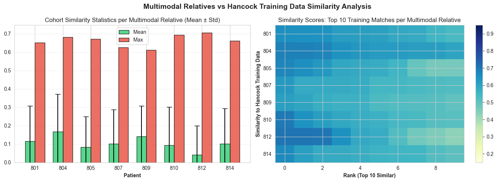
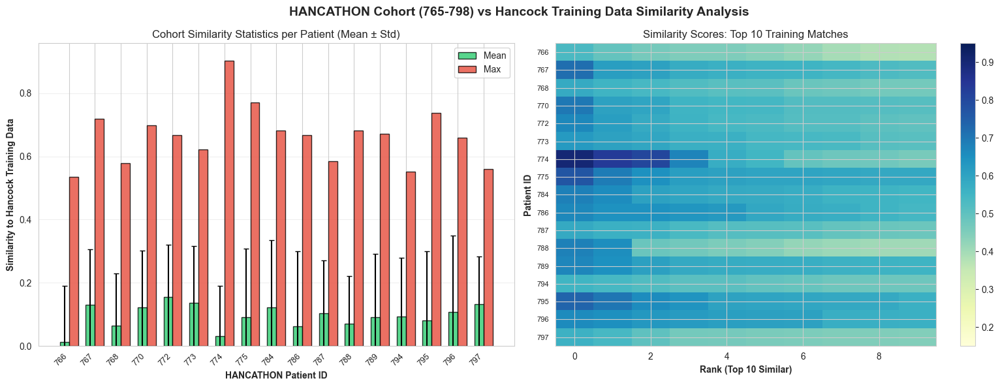
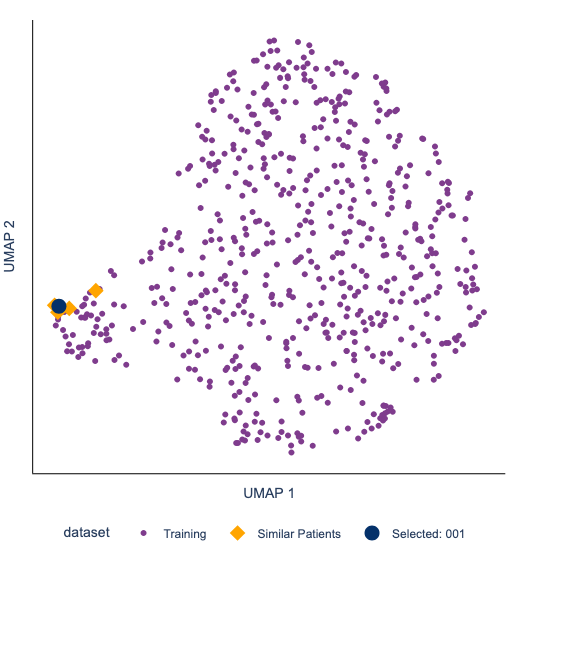
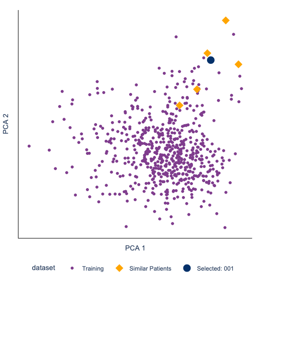
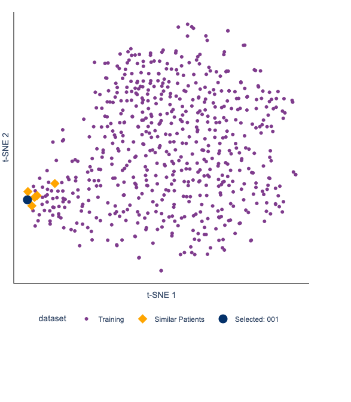
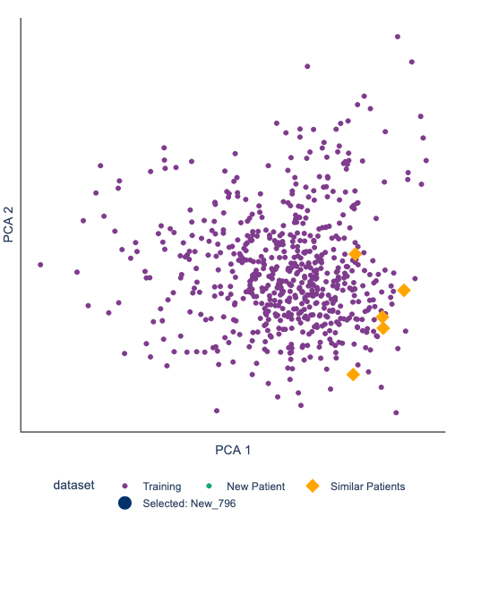
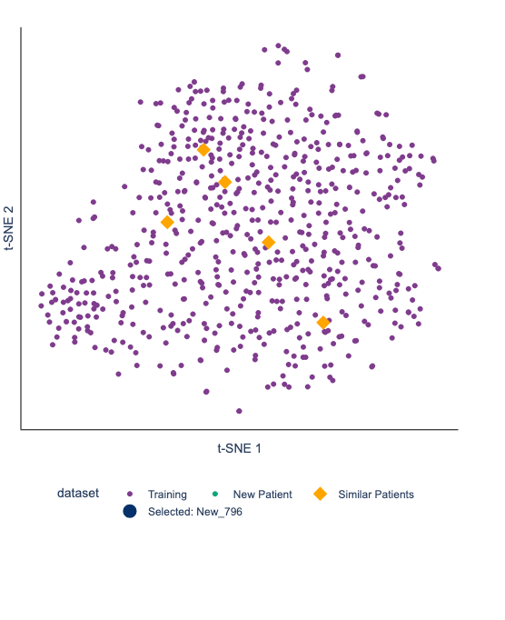
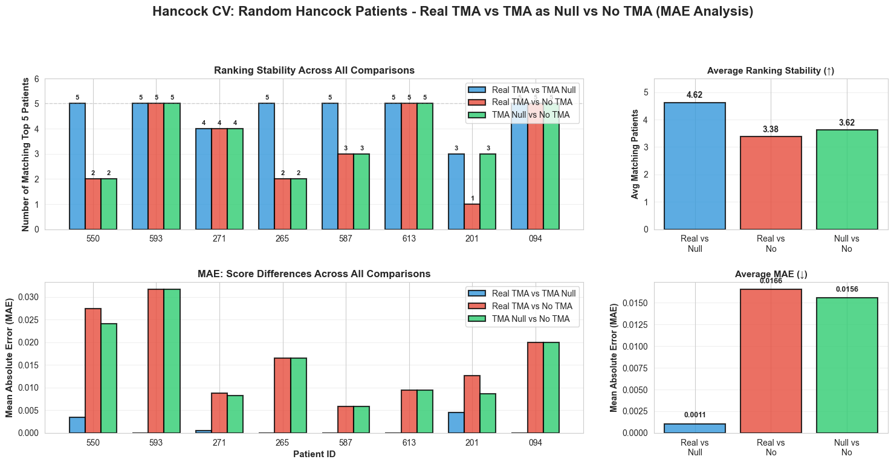
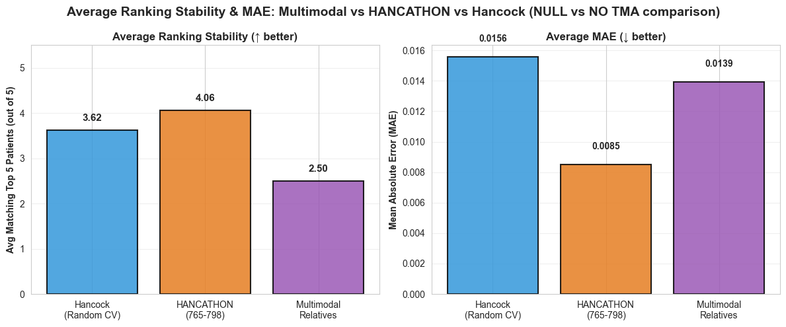

# Findings: 

## 1. Similarity of New Multimodal Relatives to Hancock Dataset

Cosine similarity was computed between each new patient (multimodal relatives, n=8) and the full Hancock training set in the preprocessed feature space.

### Multimodal Relatives (801, 804, 805, 807, 809, 810, 812, 814)

The most similar patients to the new multimodal patients have a Mean similarity score of 0.6627 ± 0.0306

### HANCATHON Cohort (765–798, n=34)

Same for the top 10 from the hancathon validation set:  0.6639 ± 0.0889

## 2. Why UMAP Neighbours ≠ Cosine Similarity Top 5

UMAP projects the high-dimensional feature space into 2D for visualisation. The layout is optimised for **local neighbourhood structure** during training using fixed `n_neighbors=15` and `min_dist=0.1` parameters. It does **not** preserve global distances.

As a result:
- Two patients can be **far apart in UMAP space** but still have **high cosine similarity** in the original encoded feature space.
- The top-5 most similar patients (by cosine) may appear scattered across the UMAP plot.

#### Compare other projection methods: UMAP vs PCA vs t-SNE

Close UMAP projection (and t-SNE):

  
  
   

Spread UMAP projection, same for other projection methods:

  
  
   

## 3. TMA Features: Include TMA Features vs. NaN in Vector vs. Excluding Entirely

The new (multimodal relative) patients do **not** have TMA features (`cd3_z`, `cd3_inv`, `cd8_z`, `cd8_inv`). The influence of TMA features to the similarity was compared by including them, setting them to Null or excluding them entirely in the hancock data.

Avg matches (TMA vs Null): 4.6/5 ± 0.7 | Avg MAE: 0.0011 ± 0.0018
Avg matches (TMA vs No):   3.4/5 ± 1.6 | Avg MAE: 0.0166 ± 0.0093
Avg matches (Null vs No):   3.6/5 ± 1.3 | Avg MAE: 0.0156 ± 0.0092

This shows that setting the TMA values to Null results in the closest results for similarity analysis. 

Another experiment shows the differnce betwenn including the TMA features as Null or excluding them in comparison of the Hancock, Hancoathon and new multimodal patients.

Hancock (CV):             Avg matches  3.62±1.22 /5 | Avg MAE: 0.0156±0.0086
HANCATHON:                Avg matches  4.06±1.11 /5 | Avg MAE: 0.0085±0.0041
Multimodal Relatives:     Avg matches  2.50±1.07 /5 | Avg MAE: 0.0139±0.0063

This shows that the biggest diffrence between setting the TMA feaures to Null and exluding them is found in the new Multimodal relatives.

## 4. TODO: Clinical Validation by Physician

The similarity model identifies the top matching Hancock training patients for each new patient. A physician should verify whether these matches are **clinically plausible**.

**Workflow:**
1. Start the dashboard `python run_app.py`
2. Load new patient data: `data/801/raw`
3. Find similar patients
3. Cross-reference additional patient data in Medona 

**Validation table (with new multimodal patients):**

| New Patient | Top 1 Similar | Top 2 Similar | Top 3 Similar | Clinically plausible? | Notes |
|---|---|---|---|---|---|
| 801 | 709 | 192 | 186 | ☐ | |
| 804 | 202 | 480 | 41 | ☐ | |
| 805 | 573 | 284 | 724 | ☐ | |
| 807 | 270 | 684 | 416 | ☐ | |
| 809 | 318 | 669 | 750 | ☐ | |
| 810 | 723 | 481 | 663 | ☐ | |
| 812 | 573 | 284 | 736 | ☐ | |
| 814 | 273 | 339 | 678 | ☐ | |

**Validation table (with hancothon patients):**

| New Patient | Top 1 Similar | Top 2 Similar | Top 3 Similar | Clinically plausible? | Notes |
|---|---|---|---|---|---|
| 774 | 379 | 555 | 152 | ☐ | |
| 775 | 396 | 234 | 507 | ☐ | |
| 767 | 620 | 503 | 293 | ☐ | |
| 770 | 539 | 496 | 685 | ☐ | |
| 795 | 313 | 146 | 221 | ☐ | |
